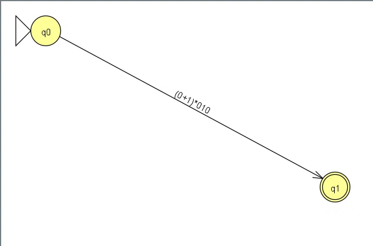
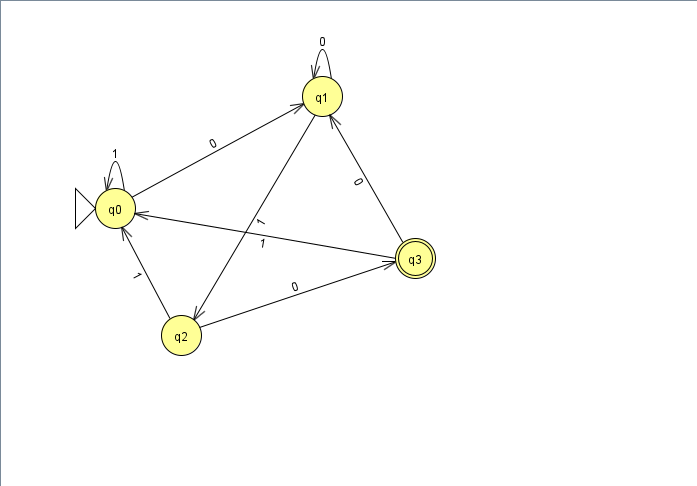
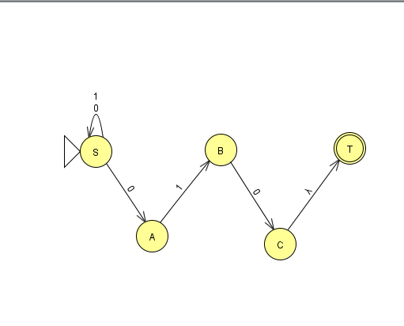

# Практическая работа №2. Регулярные выражения, грамматики и языки

**Дисциплина:** Теория автоматов, языков и вычислений  
**Вариант:** 13  
**Выполнил:** Шапельский М. В., КИ24-16/2Б  
**Преподаватель:** Н. С. Черных

---

## 1. Титульный лист

Федеральное государственное автономное образовательное учреждение высшего образования «СИБИРСКИЙ ФЕДЕРАЛЬНЫЙ УНИВЕРСИТЕТ»

Институт космических и информационных технологий  
Кафедра программной инженерии

**ОТЧЕТ О ПРАКТИЧЕСКОЙ РАБОТЕ №2**

Теория автоматов, языков и вычислений.  
Регулярные выражения, грамматики и языки

Преподаватель: Н. С. Черных  
Студент: КИ24-16/2б, 032435488, М. В. Шапельский

Красноярск 2026

---

## 2. Цель работы с постановкой задачи

**Цель:** реализация и исследование регулярных выражений, регулярных грамматик и свойств регулярных языков, а также доказательство нерегулярности языков.

**Постановка задачи (вариант 13):**

Части 1–2. Язык L13 над алфавитом {0, 1}:

    L13 = { w ∈ {0,1}* | w заканчивается на 010 }

Требуется построить регулярное выражение и регулярную грамматику, описывающие язык L13.

Часть 3. Язык L39:

    L39 = { 0^n 1^m 2^n | n, m — неотрицательные целые числа }

Требуется доказать, что L39 не является регулярным.

---

## 3. Полученное РВ

    (0+1)*010

---

## 4. Перехваты экранов с содержимым обобщенных графов переходов при пошаговом выполнении процесса преобразования РВ в КА

---

## 5. Полученная РГ и эквивалентное ей РВ

Регулярная грамматика:

    G = (V, Σ, P, S),
    V = {S, A, B, C},
    Σ = {0, 1}

    S → 0S | 1S | 0A
    A → 1B
    B → 0C
    C → ε

Эквивалентное РВ:

    (0+1)*010

---

## 6. Перехваты экранов при пошаговом выполнении процесса преобразования РГ в КА, а также в РВ

---

## 7. Формальное доказательство непринадлежности заданного языка к классу РЯ

**Утверждение:** язык L39 = { 0^n 1^m 2^n | n, m ≥ 0 } не является регулярным.

**Доказательство (лемма о разрастании):**

1. Предположим, что L39 регулярен. Тогда существует p — длина накачки.
2. Возьмём строку s = 0^p 1^p 2^p. Заметим: s ∈ L39, так как n = p, m = p, количество нулей и двоек равно p. При этом |s| = 3p ≥ p.
3. По лемме о разрастании s = xyz, где |xy| ≤ p, |y| ≥ 1.
4. Так как |xy| ≤ p, а первые p символов строки s — это нули, то xy состоит только из нулей. Значит, y = 0^k, где k ≥ 1.
5. Рассмотрим строку xy²z (накачка i = 2):

       xy²z = 0^(p+k) 1^p 2^p

6. В этой строке количество нулей равно p + k, а количество двоек равно p. Так как k ≥ 1, получаем p + k ≠ p. Условие 0^n 1^m 2^n нарушено. Следовательно, xy²z ∉ L39.
7. Противоречие с леммой о разрастании. Значит, предположение неверно.
8. **Вывод:** L39 не является регулярным языком.

---

## Приложение. JFLAP-файлы

| Файл | Описание |
|------|----------|
| L13_RE.jff | Конечный автомат, эквивалентный регулярному выражению (0+1)*010 |
| L13_Grammar.jff | Конечный автомат, эквивалентный регулярной грамматике |
